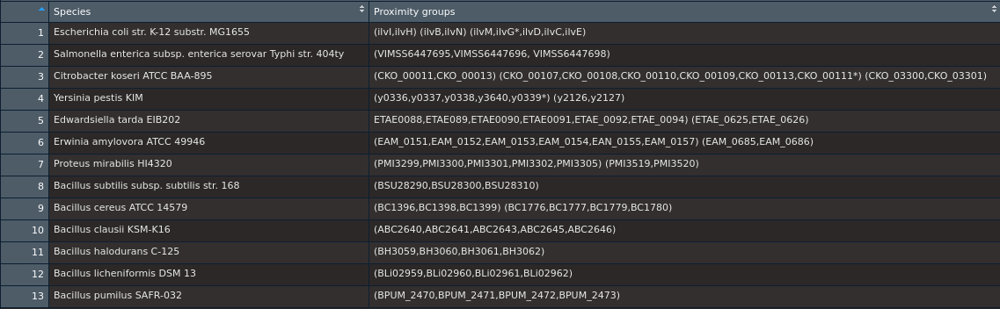

```{r setup, include=FALSE}
library(dplyr)
library(magrittr)
```

## Description

In the present assignment students are expected to choose one pair of compounds a suggested list of moieties representing a start and an end compounds to trace matebolic changes undelying their interconversion. The main aim of the assignment is stated as following: learning 'how to reconstruct a metabolic pathway using comparative genomics techniques: (1) gene neighborhood analysis; (2) domain fusion analysis; (3) phyletic gene pattern'. Respective pathways should then be traced in two bacterial families: Enterobacteriaceae (including a model Gram-negative species *Escherichia coli*) and Bacilliaceae (comprising *Bacillus subtilis*, a model Gram-positive bacterium). For my presonal assignment I choose a pair consisting of pyruvate as a starting molecule and L-valine as an end product because tracing conversion in this pair seemed to be quite a trivial task.


## Task #1. View pathway in the KEGG database

Selected compounds were searched for in KEGG Compound database (http:,,www.genome.jp,kegg,compound,) with the following search output:

```{r 1a, echo=FALSE}
data.frame(c('Pyruvate', 'L-valine'), c('C00022', 'C00183'), c('C3H4O3', 'C5H11NO2')) %>%
  `colnames<-`(c('Trivial name', 'Compound ID', 'Empirical formula'))
```

With the identifiers obtained I sought for the pathways involving both these compounds at KEGG Pathway. Search for these identifiers in the general (map) database resulted in the following pathways identified:

```{r 1b, echo=FALSE}
data.frame(c('map01060', 'map05230', 'map01063', 'map01100', 'map00290', 'map00770', 'map01110', 'map01210', 'map01230'),
           c('Biosynthesis of plant secondary metabolites', 'Central carbon metabolism in cancer',
            'Biosynthesis of alkaloids derived from shikimate pathway', 'Metabolic pathways',
            'Valine, leucine and isoleucine biosynthesis', 'Pantothenate and CoA biosynthesis',
            'Biosynthesis of secondary metabolites', '2-Oxocarboxylic acid metabolism',
            'Biosynthesis of amino acids')) %>% `colnames<-`(c('Entry', 'Name'))
```

Apparently, some of these pathways imply an undesirably high level of abstraction, while others denote metabolic pathways absent in bacteria. For further analysis I chose 'Valine, leucine and isoleucine biosynthesis' pathway (ID: map00290) as it is restricted to the synthesis of the amino acids sororital to L-valine solely. For the sake of brevity the pathway would be hereafter referred to as 'valine biosynthesis', and its branches leading to biosynthesis of amino acids other than valine would be ignored. 
The selected pathway was then analyzed for presence of respective enzyme-encoding genes in *E. coli* and *B. subtilis*.

<div align="center">  <h3><i>Escherichia coli</i></h3> </div>
```{r 1c, echo=FALSE}
task1c <- data.frame(c(rep('1', 5), '2', "2'", '3', '4', "4'", rep("4''", 2)),
           c(rep('2.2.1.6', 5), '1.1.1.86', '5.4.99.3', '4.2.1.9', '2.6.1.42', '1.4.1.9', rep('2.6.1.66', 2)),
           c('acetolactate synthase I,III small subunit', 'acetolactate synthase I,III small subunit',
             'acetolactate synthase I,III large subunit',
             'acetolactate synthase I,II,III large subunit', 'acetolactate synthase II small subunit',
             'ketol-acid reductoisomerase', '2-acetolactate mutase', 'dihydroxy-acid dehydratase',
             'branched-chain amino acid aminotransferase', 'leucine dehydrogenase', rep('alanine-synthesizing transaminase',2)),
           c('ilvH', 'ilvN', 'ilvB', 'ilvI', 'ilvM', 'ilvC', '-', 'ilvD', 'ilvE', '-', 'alaA', 'avtA'),
           c('b0077', 'b0078', 'b3670', 'b3671', 'b3679', 'b3774', '-', 'b3771', 'b3770', '-', 'b2290', 'b3572'),
           c('TPP_enzyme_N, TPP_enzyme_C, TPP_enzyme_M, POR_N, ROQ_II',
             'ALS_ss_C, ACT_5, ACT, ACT_4',
             'ACT, ACT_5, ACT_4',
             'TPP_enzyme_N, TPP_enzyme_C, TPP_enzyme_M, CO_dh, XFP_N',
             'ACT_5, ACT_4',
             'IlvN, IlvC, 2-Hacid_dh_C, NAD_binding_7, ApbA, AdoHcyase_NAD',
             '-', 'ILVD_EDD', 'Aminotran_4 G-gamma', '-', 
             'Aminotran_1_2, DegT_DnrJ_EryC1, Aminotran_5, Beta_elim_lyase, Aminotran_MocR, Cys_Met_Meta_PP', 
             'Aminotran_1_2, Beta_elim_lyase, Aminotran_MocR, Cys_Met_Meta_PP')) %>% 
  `colnames<-`(c('Step', 'EC number', 'Function', 'Gene name', 'Locus tag', 'Pfams'))

```


<div align="center">  <h3><i>Bacillus subtilis</i></h3> </div>

```{r 1d, echo=FALSE}
task1d <- data.frame(c(rep('1', 3), '2', "2'", '3', rep('4', 2), "4'", "4''"), 
           c(rep('2.2.1.6', 3), '1.1.1.86', '5.4.99.3', '4.2.1.9', rep('2.6.1.42', 2), '1.4.1.9', '2.6.1.66'),
             c('acetolactate synthase I,III small subunit',
             'acetolactate synthase I,III large subunit', 'acetolactate synthase I,II,III large subunit',
             'ketol-acid reductoisomerase', '2-acetolactate mutase', 'dihydroxy-acid dehydratase',
             rep('branched-chain amino acid aminotransferase', 2), 'leucine dehydrogenase', 'alanine-synthesizing transaminase'),
           c('ilvH','ilvB', 'alsS', 'ilvC', '-', 'ilvD', 'ybgE', 'ywaA', 'bcd', '-'),
           c('BSU28300', 'BSU28310', 'BSU3610', 'BSU28290', '-', 'BSU21870', 'BSU02390', 'BSU38550', 'BU24080', '-'),
           c('ALS_ss_C, ACT, ACT_5,ACT_4, EIIC-GAT,Pro_Al_protease',
             'TPP_enzyme_N, TPP_enzyme_C,TPP_enzyme_M, DXP_synthase_N,CO_dh',
             'TPP_enzyme_N, TPP_enzyme_C,TPP_enzyme_M',
             'IlvN, IlvC, 2-Hacid_dh_C,F420_oxidored, NAD_binding_2,AdoHcyase_NAD, CoA_binding,ApbA, GARS_N, NAD_Gly3P_dh_N,NAD_binding_7,Oxidored_nitro',
             '-', 'ILVD_EDD', rep('Aminotran_4', 2), 'ELFV_dehydrog_N, ELFV_dehydrog,2-Hacid_dh_C, AdoHcyase_NAD, adh_short_C2, NAD_binding_2,NAD_binding_7, TrkA_N, Shikimate_DH, F420_oxidored,IlvN, adh_short,UPF0146', '-')) %>% 
  `colnames<-`(c('Step', 'EC number', 'Function', 'Gene name', 'Locus tag', 'Pfams'))
```


These data were further summarized in the metabolic pathway flowchart. For the sake of consistency, 2-acetolactate mutase absent in both species is ommited.


## Task 2. Compare pathways in PATRIC

Taxonomy identifiers for suggested bacterial species were obtained from NCBI taxonomy as stated in the following tables:


<div align="center"> <h3>Enterobacteriaceae</h3> </div>

```{r 2a, echo=FALSE}
data.frame(c('Escherichia coli str. K-12 substr. MG1655',
             'Salmonella enterica subsp. enterica serovar Typhimurium str. LT2',
             'Citrobacter koseri ATCC BAA-895',
             'Yersinia pestis KIM10+',
             'Edwardsiella tarda EIB202',
             'Erwinia amylovora ATCC 49946',
             'Proteus mirabilis HI4320'), c('511145', '99287', '290338', '187410', '498217', '716540', '529507')) %>% `colnames<-`(c('Species name', 'Taxonomy ID'))

```


<p style="text-align: center;"> <h3>Bacilliaceae</h3> </p>

```{r 2b, echo=FALSE}
data.frame(c('Bacillus subtilis subsp. subtilis str. 168',
             'Bacillus cereus ATCC 14579',
             'Bacillus clausii KSM-K16',
             'Bacillus halodurans C-125',
             'Bacillus licheniformis DSM 13',
             'Bacillus pumilus SAFR-032'),
           c('224308', '226900', '66692', '272558', '279010', '315750')) %>% `colnames<-`(c('Species name', 'Taxonomy ID'))

```

The suggested genomes were selected as queries for 00290 pathway mapping at PATRIC database as suggested in the task wording. In Enteroacteriaceae batch two species, namely *Y. pestis* and *E. tarda* were found to be devoid of any genes involved in the pathway (data not shown); in other species all genes were present by at least one copy, and one gene encoding actolactate synthase (EC 2.2.16) was present in more than three paralogous copies in all the species. Speaking of Bacilliaceae, gene encoding valine-piruvate transaminase is absent in all species except for *B. licheniformes* while other are present in one (e.g. ketol-acid reductoisomerase), two (3-isopropylmalate dehydratase) or varying number of copies.

## Task #3. Observe gene co-localization (physical linkage on chromosome)

We then elucidated ortholog distribution in the surveyed genomes by using MicrobesOnline as suggested in the assignment wording:

```{r 3a, echo=FALSE}

df.3a <- data.frame(c('Escherichia coli str. K-12 substr. MG1655 name',
             'Escherichia coli str. K-12 substr. MG1655',
             'Salmonella enterica subsp. enterica serovar Typhi str. 404ty*',
             'Citrobacter koseri ATCC BAA-895',
             'Yersinia pestis KIM',
             'Edwardsiella tarda EIB202',
             'Erwinia amylovora ATCC 49946',
             'Proteus mirabilis HI4320',
             'Bacillus subtilis subsp. subtilis str. 168 name',
             'Bacillus subtilis subsp. subtilis str. 168',
             'Bacillus cereus ATCC 14579',
             'Bacillus clausii KSM-K16',
             'Bacillus halodurans C-125',
             'Bacillus licheniformis DSM 13',
             'Bacillus pumilus SAFR-032'),
           c('ilvH,ilvN,ilvB,ilvM,ilvI', 'b0078,b3670,b3671,b3769,b0077', 'VIMSS6441478,VIMSS6447697,VIMSS6449022,VIMSS6443741,VIMSS6447147,VIMSS6447437,VIMSS6447698',
             'CKO_00011,CKO_00013,CKO_00107,CKO_00108,CKO_03300,CKO_03301', 'y0336,y2126,y2127,y3639,y3640', 'ETAE_0088,ETAE_0089,ETAE_0625,ETAE_0626', 'EAM_0013,EAM_0151,EAM_0152,EAM_0685,EAM_0686',
             'PMI3299,PMI3300,PMI3519,PMI3520,PMI1058', 'ilvH,ilvB,alsS', 'BSU28300,BSU28310,BSU36010', 'BC0883,BC1398,BC1777', 'ABC2644,ABC2645,ABC2009', 'BH3060,BH3061,BH3873', 'BLi02960,BLi02961,BLi03848', 'BPUM_2471,BPUM_2472,BPUM_3271'), 
           c('ilvC', 'b3774', 'VIMS6446998', 'CKO_00113', 'y0345', 'ETAE_0094', 'EAM_0157', 'PMI3305', 'ilvC', 'BSU28290','BC1399,BC1779', 'ABC2643', 'BH3059', '-', 'BPUM_2470'), 
           c('ilvD,yagF', 'b0269,b3771', 'VIMSS6446633,VIMSS6447694', 'CKO_00110', 'y0338', 'ETAE_0091', 'EAM_0154', 'PMI3302', 'ilvD', 'BSU21870', '	BC1780', 'ABC2646,ABC1110', 'BH3062
', '-', 'BPUM_1922'), 
           c('ilvE', 'b3770', 'VIMSS6447695,VIMSS6447696', 'CKO_00109', 'y0337', 'ETAE_0090', 'EAM_0153,EAM_2126', 'PMI3301', 'BSU02390,BSU38550', 'ybgE,ywaA', 'BC1396,BC1776', 'ABC1931', 'BH2156,BH0092', '-', 'BPUM_3500,BPUM_2473'),
           c('avtA', 'b3572', 'VIMSS6441439,VIMSS6443570,VIMSS6445872', 'CKO_05030', '-', 'ETAE_0010', 'EAM_3445', ' PMI2852', '-',  '-', '-', '-', '-', 'BLi04237', '-'),
           c('-', '-', '-', '-', '-', '-', '-', '-', '-', '-', '-', '-', 'BH0218', 'BLi02585', 'BPUM_2147')) %>% `colnames<-`(c('Species', 'EC 2.2.1.6', 'EC 1.1.1.86', 'EC 4.2.1.9', 'EC 2.6.1.42', 'EC 2.6.1.66', 'EC 1.4.1.9'))

```


\*The selected salmonella genome was absent in the database so a randomly picked genome for serovar *Typhi* was used for gene annotation

Consistently with the previously obtained data, these results indicate that genes encoding 	acetolactate synthase subunits are overrepresented in bacterial genomes, presumably because of multisubunit structure of the enzyme. They also agree on exclusiveness of leucine dehydrogenase genes for Bacilliaceae and 	alanine-synthesizing transaminase for Enterobacteriaceae. At the same time, several discrepancies were found. For instance, most of the genes indicated as absent by PATRIC were discovered during the MicrobesOnline survey. Also, a gene encoding for leucine dehydrogenase is absent in the reference *B. subtilis* genome though found in other strains of the same species as well as in several selected Bacilliaceae members.
Beyond that, MicrobesOnline offers domain structure of the contained genes. For the sake of consistency only genes from *E. coli* and *B. subtilis* were checked for their domain content.

<div align="centered"> <i><h3>E. coli</h3></i></div>

```{r 3b, echo=FALSE}

data.frame(c('ilvH', 'ilvN', 'ilvB', 'ilvI', 'ilvC', 'yagF', 'ilvD', 'ilvE', 'avtA'),
           c('PF01842,PF10369', 'PF01842', 'PF02776,PF00205,PF02775', 'PF02776,PF00205,PF02775', 'PF07991,PF01450,PF01450', 'PF00920', 'PF00920', 'PF01063', 'PF00155')) %>% `colnames<-`(c('Gene name', 'Found pfams'))

```


<div align="center"> <i><h3>B. subtilis</h3></i></div>

```{r 3c, echo=FALSE}

data.frame(c('ilvH', 'ilvB', 'alsS', 'ilvC', 'ilvD', 'ybgE', 'ywaA', 'bcd*'),
           c('PF01842,PF10369', 'PF02776,PF00205,PF02775', 'PF02776,PF00205,PF02775', 'PF02826,PF07991,PF01450', 'PF00920', 'PF01063', 'PF01063', 'PF02812,PF00208')) %>% 
  `colnames<-`(c('Gene name', 'Found pfams'))

```

\* since *bcd* gene was absent in the reference strain, information on the respective protein structure was obtained from *Bacillus subtilis* subsp. *subtilis* str. NCIB 3610 by proxy.


## Task #4. Observe gene co-localization (physical linkage on chromosome)

Genes mined in the previous two tasks were then analyzed for physical lincage by neighborhood. The suggested procedures were carried out to visualize juxtaposing genes for each entry in each genome. The results are presented in the following table. Note that neighboring genes are joined by parentheses.

```{r 4a, echo=FALSE}

df.4a <- data.frame(c('Escherichia coli str. K-12 substr. MG1655',
             'Salmonella enterica subsp. enterica serovar Typhi str. 404ty',
             'Citrobacter koseri ATCC BAA-895',
             'Yersinia pestis KIM',
             'Edwardsiella tarda EIB202',
             'Erwinia amylovora ATCC 49946',
             'Proteus mirabilis HI4320',
             'Bacillus subtilis subsp. subtilis str. 168',
             'Bacillus cereus ATCC 14579',
             'Bacillus clausii KSM-K16',
             'Bacillus halodurans C-125',
             'Bacillus licheniformis DSM 13',
             'Bacillus pumilus SAFR-032'),
           c('(ilvI,ilvH) (ilvB,ilvN) (ilvM,ilvG*,ilvD,ilvC,ilvE)',
             '(VIMSS6447695,VIMSS6447696, VIMSS6447698)',
             '(CKO_00011,CKO_00013) (CKO_00107,CKO_00108,CKO_00110,CKO_00109,CKO_00113,CKO_00111*) (CKO_03300,CKO_03301)',
             '(y0336,y0337,y0338,y3640,y0339*) (y2126,y2127)',
             'ETAE0088,ETAE089,ETAE0090,ETAE0091,ETAE_0092,ETAE_0094) (ETAE_0625,ETAE_0626)',
             '(EAM_0151,EAM_0152,EAM_0153,EAM_0154,EAN_0155,EAM_0157) (EAM_0685,EAM_0686)',
             '(PMI3299,PMI3300,PMI3301,PMI3302,PMI3305) (PMI3519,PMI3520)',
             '(BSU28290,BSU28300,BSU28310)',
             '(BC1396,BC1398,BC1399) (BC1776,BC1777,BC1779,BC1780)',
             '(ABC2640,ABC2641,ABC2643,ABC2645,ABC2646)',
             '(BH3059,BH3060,BH3061,BH3062)',
             '(BLi02959,BLi02960,BLi02961,BLi02962)',
             '(BPUM_2470,BPUM_2471,BPUM_2472,BPUM_2473)')) %>% `colnames<-`(c('Species', 'Proximity groups'))

```




\* genes not identified in the primary search but observed on manual proximity investigation

Apparently, in all the genomes at least one proximity group comprising of core metabolic genes is preserved. In some cases interspersed genes for acetolactate synthase subunits nucleate additional gene islands which may fall under the same regulon in a manner similar to that of core enzyme genes.


## Task #5. Observe various levels of interactions between the observed gene

For the final I chose *E. coli* gene *ilvD* encoding dihydroxy-acid dehydratase (EC 4.2.1.9). Interaction network reconstruction with default settings resulted in ten-node primary shell with moderate connectivity:


Then, four parameters were consecutively left as sole source of interaction evidence:


It is clear that co-occurrence is the largest as well as densest of all four evidence-wise networks while fusion network indicating reading frame union events is the smallest one with two vertices and one edge only. The most rewarding part of this piece of analysis is concordance between neighborhood network and previous proximity survey which underpins the idea that core enzymes of valine biosynthesis are most likely to be grouped together within the genome.


## Conclusion

Despite the lack of convenient APIs, the exploited databases offer great opportunities for comparative genomics. In the case of valine synthesis from pyruvate precursor one could not only trace the metabolic pathway in different bacteria but also dissect similarities in gene content, spatial occurrence and regulation mechanisms among these species.

```{r sessioninfo}

sessionInfo()
```